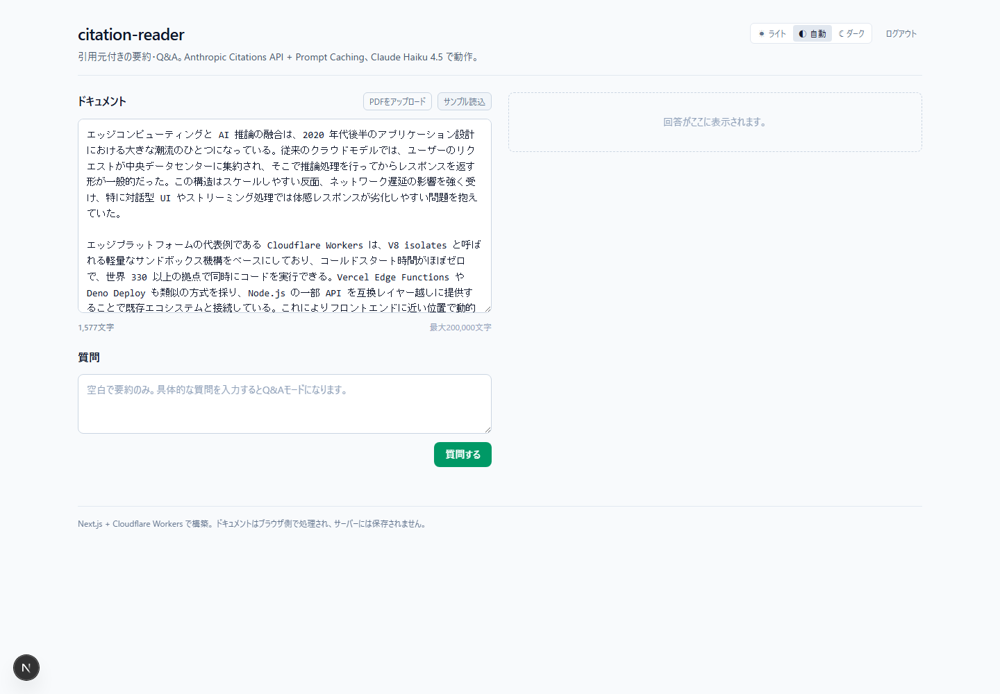
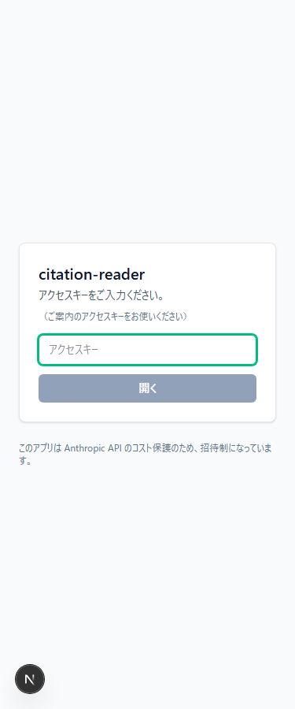
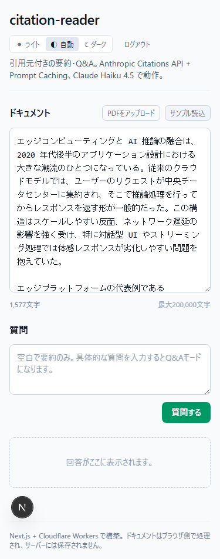
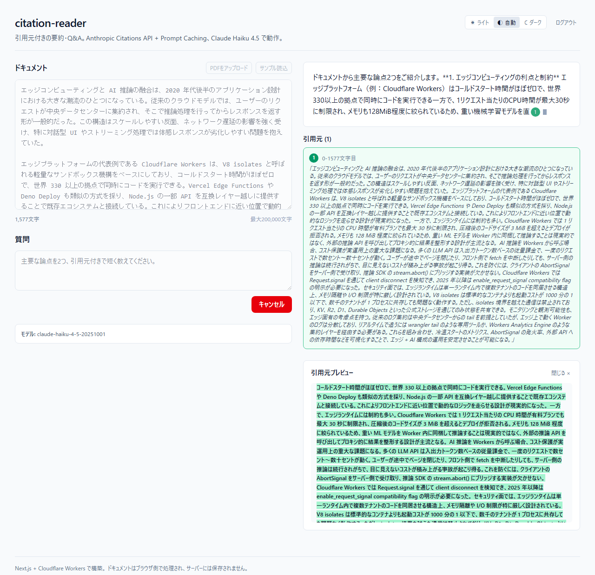

# citation-reader

> 引用元付きの AI 要約・Q&A ミニアプリ。Anthropic Citations API と Prompt Caching の実運用デモ。

テキストや PDF を投入すると、Claude が要約と質問応答を返し、回答中のバッジをクリックすると原文の該当箇所がハイライトで示されます。採用評価向けのデモを想定した招待制（アクセスキー方式）。

## Demo

- **Live demo**: https://citation-reader.atlas-lab.workers.dev （招待制、アクセスキーが必要）
- **Source**: https://github.com/proto-atlas/citation-reader

### なぜアクセスキー制か

Anthropic API は入出力トークン数に応じた従量課金です。1 リクエストで数セント〜数十セント動くため、無認証で公開すると AI コストの消費攻撃を受ける可能性があります。本デモは採用評価のための招待制とし、アクセスキー（Bearer + constant-time 比較）+ IP レート制限 + Anthropic Spend Limit の三段で守っています。アクセスキーが手元にない場合は、下のスクリーンショットで体験のおおよそが伝わります。

### Screenshots

| Desktop | Mobile (auth gate) | Mobile (main) |
|---|---|---|
|  |  |  |

引用バッジをクリックすると原文の該当箇所がハイライトされます:



## Features

- **引用元付き要約・Q&A**: Anthropic Citations API による streaming 表示、バッジ → 原文ハイライト
- **PDF 直接アップロード**: ブラウザ側の pdfjs-dist で抽出、本文をサーバーに送らない
- **コスト保護の多層ゲート**: アクセスキー（Bearer, constant-time 比較）+ IP レート制限（5 req/60s/isolate、`/api/auth` `/api/chat` 両方）+ Anthropic 側 Spend Limit
- **Prompt Caching**: `ephemeral` 5 分 TTL、トークン使用量を UI 表示
- **キャンセル連動**: UI の中断 → `AbortSignal` → `MessageStream.abort()` で Anthropic 側も即停止
- **エラー文言の整形**: サーバ側で内部エラー詳細を漏らさず、UI には `ChatErrorCode` ベースの日本語文言のみ表示（OWASP Improper Error Handling 対応）
- **セキュリティヘッダ**: HSTS / X-Content-Type-Options / X-Frame-Options DENY / Referrer-Policy / Permissions-Policy + Content-Security-Policy（XSS 最終防衛）
- **a11y**: 全操作要素にラベル関連付け（`htmlFor`）、44px タッチターゲット、引用元リストもキーボード操作可能（`button` 化）、WCAG AA コントラスト
- **ダークモード手動トグル**: ライト / 自動（OS 追従）/ ダーク、`localStorage` 記憶 + FOUC 防止
- **Next.js 16 App Router + Cloudflare Workers** のエッジ配信

## Lighthouse (production)

[Production URL](https://citation-reader.atlas-lab.workers.dev/) を 2026-04-26 時点で計測:

| カテゴリ | スコア |
|---|---:|
| Performance | 96 |
| Accessibility | 95 |
| Best Practices | 96 |
| SEO | 100 |

主要メトリクス: FCP 0.9s / LCP 1.9s / CLS 0 / TBT 200ms。

アクセシビリティ / セキュリティ面では、コントラスト・44px タッチターゲット・`htmlFor` 関連付け・引用元リスト button 化・CSP / `/api/auth` rate-limit / error sanitize 等を実装済みです。

## Tech Stack

- Next.js 16.2.4 (App Router, **webpack build**)
- React 19.2.5
- TypeScript 6.0.3 (strict 最大、`any` 禁止)
- Tailwind CSS 4.2.4 (class 戦略 dark mode via `@custom-variant`)
- `@anthropic-ai/sdk` 0.90.0 (Citations + Prompt Caching)
- `pdfjs-dist` 5.6.205 (クライアント側抽出)
- `@opennextjs/cloudflare` 1.19.3 + wrangler 4.84.1
- ESLint 10 (flat config) + Prettier 3
- Vitest 4.1.5 (ユニット 134、coverage stmts 80 / branches 78 / funcs 81 / lines 82) + happy-dom + Playwright 1.59 (E2E 5 ブラウザ matrix: Chromium / Firefox / WebKit / mobile-chrome / mobile-safari)

## Requirements

- Node.js 24.x LTS
- npm 11+

## Development

```bash
npm install
cp .env.local.example .env.local
# .env.local を編集して ACCESS_PASSWORD と ANTHROPIC_API_KEY を設定
npm run dev
```

開いたタブでアクセスキーを入力 → メイン UI が開きます。サンプル読込ボタンで動作確認できます。

### pre-commit hook セットアップ（初回のみ）

禁止ワード検出を commit 時に自動実行するため、初回だけ以下を実行:

```bash
npx husky init
cp scripts/husky-pre-commit.template.txt .husky/pre-commit
chmod +x .husky/pre-commit
```

以降 `git commit` 時に `scripts/check-before-publish.sh` が自動実行されます。

## Scripts

| Command | Description |
|---|---|
| `npm run dev` | ローカル開発サーバ（`next dev`） |
| `npm run build` | 本番ビルド（`next build --webpack`） |
| `npm run typecheck` | TypeScript 型チェック |
| `npm run lint` | ESLint + Prettier |
| `npm run lint:fix` | 自動修正 |
| `npm test` | Vitest ユニットテスト |
| `npm run test:coverage` | カバレッジ付きテスト（thresholds: lines 60% / functions 70% / branches 50%） |
| `npm run e2e` | Playwright E2E（全ブラウザ） |
| `npm run check` | typecheck + lint + test |
| `npm run check:publish` | 禁止ワード grep（commit 前推奨。Node スクリプト `scripts/check-before-publish.mjs` で Windows / macOS / Linux すべて動く。bash 版 `scripts/check-before-publish.sh` も互換維持で残置） |
| `npm run preview` | OpenNext build + Cloudflare ローカルプレビュー |
| `npm run deploy` | OpenNext build + Cloudflare Workers デプロイ |

`postinstall` で `scripts/copy-pdf-worker.mjs` が `node_modules/pdfjs-dist/build/pdf.worker.min.mjs` を `public/` にコピーします（OpenNext が `.open-next/assets/` に取り込む）。

## Architecture

詳細は [docs/ARCHITECTURE.md](./docs/ARCHITECTURE.md)。

## Design Decisions

各設計判断の背景とトレードオフは [docs/DESIGN-DECISIONS.md](./docs/DESIGN-DECISIONS.md)。

## Deployment

Cloudflare Workers 経由で公開します。初回だけ Secrets 設定:

```bash
npx wrangler login
npx wrangler secret put ACCESS_PASSWORD
npx wrangler secret put ANTHROPIC_API_KEY
npm run deploy
```

### Windows 環境の注意

OpenNext は Windows 公式サポート外です。`npm run preview` はローカルで 500 を返す可能性がありますが、本番 Cloudflare Workers は Linux 相当 workerd で動くため影響しません。ローカル検証は `npm run dev` のみ使用してください。

## Testing

```bash
npm run check                          # typecheck + lint + Vitest (134)
npm run test:coverage                  # coverage gate (lines 60 / functions 70 / branches 50 / statements 60)
npx playwright test --project=chromium # E2E (5 シナリオ × 5 ブラウザ matrix で CI 並列実行、port 3210 固定)
```

E2E は `playwright.config.ts` の `webServer.env` に E2E 専用 `ACCESS_PASSWORD` を注入する設計で、`.env.local` の値には依存しません。`/api/chat` は `page.route()` で SSE モックして実 Anthropic への課金を発生させません。

## CI / DevOps

GitHub Actions (`.github/workflows/ci.yml`) で以下 3 ジョブが走ります:

| ジョブ | 内容 |
|---|---|
| `quality-gate` | typecheck → lint → `test:coverage` (閾値強制) → `npm audit --audit-level=high` → 禁止ワード scan (`scripts/check-secrets.sh`) → build |
| `e2e` | Playwright 5 ブラウザ matrix (Chromium / Firefox / WebKit / mobile-chrome / mobile-safari) で 5 シナリオ並列実行 (auth gate / chat 主要フロー / 引用クリック)。`quality-gate` 通過後、`fail-fast: false` で全ブラウザ結果を artifact 保存 |
| `deploy` | `main` への push のみ。`quality-gate` + `e2e` 通過後、`CLOUDFLARE_API_TOKEN` + `CLOUDFLARE_ACCOUNT_ID` が repo secrets に登録されている場合だけ Cloudflare Workers へ自動 deploy。未設定の場合は skip |

`npm audit` は `--audit-level=high` でブロッキング、`moderate` レベルは Next.js / OpenNext の transitive 由来でアップストリーム修正待ちのため意図的に許容しています (下記「Dependencies and Known Constraints」)。

ローカル `SPEC.md` は本リポジトリ専用の内部メモで、公開対象外です (`.gitignore`)。CI / Architecture / 設計判断の Public 説明はこの README と `docs/ARCHITECTURE.md` / `docs/DESIGN-DECISIONS.md` に集約しています。

## Public Evidence

機械検証可能な品質証跡を [`docs/evidence/`](./docs/evidence/) に集約しています ([インデックス](./docs/evidence/README.md))。採用評価担当者は以下の項目を Public な状態で確認できます:

- [`dependency-audit-2026-04-27.md`](./docs/evidence/dependency-audit-2026-04-27.md) — npm audit `moderate` 6 件の出自・代替検討・上流追跡
- [`eval-result-2026-04-27.json`](./docs/evidence/eval-result-2026-04-27.json) — LLM 出力品質評価の最新結果 (Markdown 混入 / 言語一致 / 引用件数の 3 軸、純関数は [`eval/evaluators.ts`](./eval/evaluators.ts) で実装、Vitest 23 件カバー)
- CI quality-gate / e2e matrix の実行履歴 — `.github/workflows/ci.yml` および GitHub Actions の artifact (`playwright-report-{browser}`)

Lighthouse / axe / license inventory は本番 deploy 後のサイクルで `docs/evidence/` に追加予定。

## LLM Evaluation Harness

`/api/chat` の出力品質を 3 軸 (Markdown 混入 / 言語一致 / 引用件数・重複率) で機械的に検査する評価ハーネスを [`eval/`](./eval/) 配下に実装しています。

```bash
npm run eval               # mock モード (Anthropic 課金ゼロ、CI 用)
# v0.2 で live モード (本番 URL に対する実評価) を実装予定
```

評価結果は `docs/evidence/eval-result-{date}.json` に出力されます。

## Dependencies and Known Constraints

### npm audit

`npm audit` で `moderate` 6 件が検出されますが、いずれも `next@16.2.4` 配下の `postcss@8.4.31` と `@aws-sdk/xml-builder` 経由の `fast-xml-parser@5.5.8` 由来です。`npm audit fix --force` は `next` を 9 系へダウングレードする提案を含むため適用していません。本リポジトリでは Next.js / OpenNext の次リリースで連鎖修正される想定で、状況を `docs/DESIGN-DECISIONS.md` に記録しています。

### LGPL コンポーネント

`@img/sharp-win32-x64@0.34.5` のライセンスに `LGPL-3.0-or-later` が含まれます。これは `sharp` の optional binary 依存で、`sharp` 自体も `next` の optional dependency 経由 (Image Optimization 用) です。Cloudflare Workers にデプロイする本アプリでは Linux x64 binary が選ばれるため、Windows 版 binary を再配布する形にはなりません。配布形態としての LGPL 義務は発生しないと判断しています（npm のライセンス情報自体は `npx license-checker` で確認可能）。

### `esbuild` 直接 devDependency

`esbuild` は `@opennextjs/cloudflare` の peer 要件として明示的に devDep に置いています。本リポジトリのソースから直接 import はしていません。

## License

MIT
